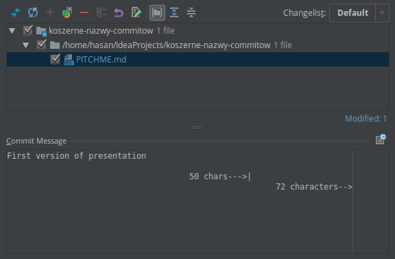

## Koszerne nazwy commitów
##### Jak pisać dobre, efektywne opisy do #git.owych commitów i dlaczego jest to ważne?
---

## Wujek Bob namieszał....


---

###Tak wyglądały moje commity rok temu:
```zsh
$ git log --oneline -5 --author mrowicki --before "Fri Thu 30 2016"
1994130 3 fixes of FXS test: * fix setting end of GTD FXS test in case when LB can not ring * fix rescue step reset FXS script * fix setting fail FXS test step LB3 Pro * upgrade every instanse of SG91150456 FMW because of FXS fixes #2720
39b5bdf waiting for device added in Factory Reset probe
e4cc7d8 fixed bug with checking screens
8761ada Remove space
dded890 SmUHD90AftersaleModeSelftests.xml - setInconclusiveResultIfFailed - true added
```

+++

###Tak wyglądają teraz:
```zsh
$ git log --oneline -5 --author mrowicki --before "Fri Thu 30 2017"
c172e21 Fix ETH naming convention 
1d173b8 Make corrections after code review
741544d Apply new lanrescue
d1e6aff Fix schema xsd
92b6a36 Correct error name in SmUhd90Selftests.java
```

+++

#Które wolałbyś czytać?

+++

###Różnice:

1. Zwięzłość
2. Spójność
3. ??

---

###A jak radzą sobie z tym najlepsi?

1. [Linux kernel](https://github.com/torvalds/linux/commits/master)
1. [Git](https://github.com/git/git/commits/master)
1. [Spring Boot](https://github.com/spring-projects/spring-boot/commits/master)

---

###Co musimy ustalić, aby uzyskać taką spójność naszych commitów?

1. **Styl** (marginesy, interpunkcja, kapitalizacja, gramatyka...)
1. **Treść**
1. **Metadane**

---

### 7 zasad do lepszego rejestrowania zmian w Gicie

+++

1. Rozdziel temat od ciała commita pustą linią
1. Ogranicz długość tematu do 50 znaków
1. Rozpocznij temat z dużej litery
1. Nie kończ tematu kropką
1. Użyj trybu rozkazującego (ang. *imperative*) w tytule
1. Nie przekraczaj 72. znaków w ciele
1. Użyj ciała, aby opisać co? dlaczego? i jak?

* Dodaj metatagi na końcu, musi je dzielić jedna pusta linia

+++

####Przykład
```
Summarize changes in around 50 characters or less

More detailed explanatory text, if necessary. Wrap it to about 72
characters or so. In some contexts, the first line is treated as the
subject of the commit and the rest of the text as the body. The
blank line separating the summary from the body is critical (unless
you omit the body entirely); various tools like `log`, `shortlog`
and `rebase` can get confused if you run the two together.

Explain the problem that this commit is solving. Focus on why you
are making this change as opposed to how (the code explains that).
Are there side effects or other unintuitive consequences of this
change? Here's the place to explain them.

Further paragraphs come after blank lines.

 - Bullet points are okay, too

 - Typically a hyphen or asterisk is used for the bullet, preceded
   by a single space, with blank lines in between, but conventions
   vary here

If you use an issue tracker, put references to them at the bottom,
like this:

Resolves: #123
See also: #456, #789
```

+++

###IntellIJ IDEA pomoże Ci!


---

###Dziękuję! Pytania?


---
## Bibliografia
1. https://chris.beams.io/posts/git-commit/
1. http://who-t.blogspot.co.at/2009/12/on-commit-messages.html
1. http://tbaggery.com/2008/04/19/a-note-about-git-commit-messages.html
1. https://www.git-scm.com/book/en/v2/Distributed-Git-Contributing-to-a-Project#_commit_guidelines
1. https://github.com/torvalds/subsurface-for-dirk/blob/master/README#L92-L120
1. https://github.com/erlang/otp/wiki/writing-good-commit-messages
1. https://github.com/spring-projects/spring-framework/blob/30bce7/CONTRIBUTING.md#format-commit-messages
1. https://stackoverflow.com/questions/2290016/git-commit-messages-50-72-formatting