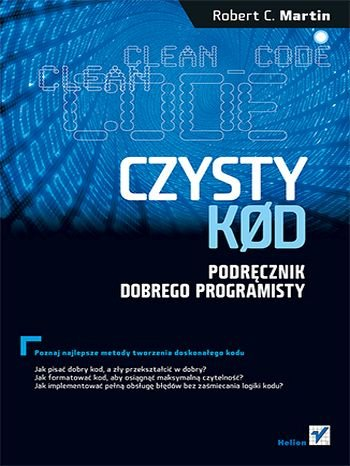

## Koszerne nazwy commitów
##### Jak pisać dobre, efektywne opisy do #git.owych commitów i dlaczego jest to ważne?
---

## Wujek Bob namieszał....



---

###Tak wyglądały moje commity rok temu:
```zsh
$ git log --oneline -5 --author mrowicki --before "Fri Thu 30 2016"
1994130 3 fixes of FXS test: * fix setting end of GTD FXS test in case when LB can not ring * fix rescue step reset FXS script * fix setting fail FXS test step LB3 Pro * upgrade every instanse of SG91150456 FMW because of FXS fixes #2720
39b5bdf waiting for device added in Factory Reset probe
e4cc7d8 fixed bug with checking screens
8761ada Remove space
dded890 SmUHD90AftersaleModeSelftests.xml - setInconclusiveResultIfFailed - true added
```

+++

###Tak wyglądają teraz:
```zsh
$ git log --oneline -5 --author mrowicki --before "Fri Thu 30 2017"
c172e21 Fix ETH naming convention 
1d173b8 Make corrections after code review
741544d Apply new lanrescue
d1e6aff Fix schema xsd
92b6a36 Correct error name in SmUhd90Selftests.java
```

+++

##Które wolałbyś czytać?

---
## Bibliografia
1. https://chris.beams.io/posts/git-commit/
1. 